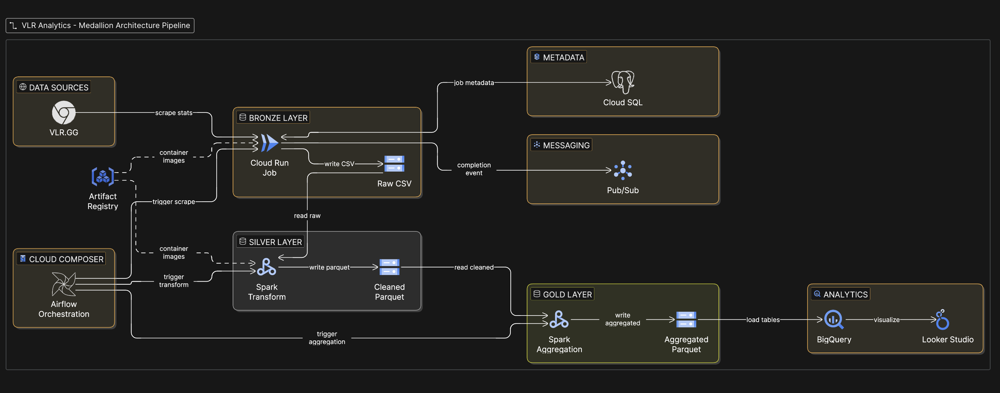

# VLR Analytics

**Cloud-Native Lakehouse for Valorant Competitive Data**

VLR Analytics is a production-style data engineering project that implements a **Medallion (Bronze–Silver–Gold) architecture** on Google Cloud Platform to ingest, process, and analyze competitive Valorant statistics from VLR.GG.

The system processes **500K–1M player performance records** across competitive events, with a full pipeline running end-to-end in under 40 minutes — from raw scrape to analytics-ready Gold tables in BigQuery.

---

# Architecture



---

# Processing Strategy

## Initial Backfill (Batch)

* Historical events are processed in bulk across all scraped events.
* Airflow dispatches Cloud Run jobs in batches.
* Silver and Gold transformations run after ingestion completes.
* Ensures a complete historical dataset before incremental scheduling begins.

## Incremental Processing (Every 15 Days)

* Airflow triggers the ingestion DAG every 15 days.
* New event metadata is queried from PostgreSQL.
* Only unprocessed events are dispatched to Cloud Run.
* Downstream Spark transformations run after completion signals via Pub/Sub.

This design supports both **large-scale historical ingestion** and **lightweight incremental updates** without reprocessing existing data.

---

# Technology Stack

| Component              | Service                                         |
| ---------------------- | ------------------------------------------------|
| Orchestration          | Cloud Composer (Airflow)                        |
| Scraping Compute       | Cloud Run                                       |
| Distributed Processing | Google Cloud Dataproc (Apache Spark Serverless) |
| Data Lake Storage      | Google Cloud Storage                            |
| Data Warehouse         | BigQuery                                        |
| Visualization          | Looker Studio                                   |
| Messaging              | Google Cloud Pub/Sub                            |
| Metadata Store         | Cloud SQL (PostgreSQL)                          |
| Infrastructure as Code | Terraform                                       |

---

# Data Architecture

## Bronze Layer — Raw Ingestion

**Service:** Cloud Run  
**Format:** CSV  
**Storage:** Cloud Storage

* Scrapes player statistics across competitive events from VLR.GG
* Each Cloud Run job completes in **under 5 minutes** per event
* Writes partitioned raw CSV data to Cloud Storage
* Emits a Pub/Sub completion event upon success
* Stores ingestion status metadata in PostgreSQL for idempotent reruns

### Partitioning Scheme

```
gs://vlr-data-lake/bronze/
  event_id={event_id}/
  region={region}/
  map={map}/
  agent={agent}/
  snapshot_date={date}/data.csv
```

---

## Silver Layer — Clean & Structured

**Service:** Dataproc (Spark)  
**Format:** Parquet

Transformations applied to **500K–1M raw records**:

* Schema enforcement and type casting
* Deduplication on composite business key: `(player_id, snapshot_date, agent, map, event_id, region)`
* Percentage normalization and clutch ratio parsing
* Null handling and string normalization

Data is written as partitioned Parquet, optimized for downstream analytical reads.

---

## Gold Layer — Aggregated Analytics

**Service:** Dataproc (Spark)  
**Format:** Parquet

Aggregated datasets produced:

* Player career statistics
* Agent performance distribution
* Map-level performance metrics
* Team-level win rates
* Event-level summaries

Silver and Gold Spark transformations run sequentially and complete within **15–20 minutes** combined, triggered automatically via Pub/Sub after Bronze ingestion confirms success.

Gold tables are loaded into BigQuery for SQL-based analysis and dashboard consumption.

---

# Pipeline Performance

| Stage                        | Duration         |
|-----------------------------|------------------|
| Cloud Run scrape (per event) | < 5 minutes      |
| Spark Silver + Gold transforms | 15–20 minutes  |
| Full Airflow DAG (end-to-end) | 20–40 minutes   |
| Records processed             | 500K–1M rows     |
| Events ingested               | ~100 events      |

---

# Analytics Layer

## BigQuery

* Parquet tables loaded from Gold layer
* Structured analytics datasets available for ad-hoc SQL queries
* Optimized partitioning for dashboard query performance

## Looker Studio

* Player performance dashboards
* Team comparison views
* Event summaries
* Historical performance trends

---

# Orchestration Design

Two Airflow DAGs coordinate the full pipeline:

### 1. Ingestion Dispatcher

* Runs every 15 days
* Queries PostgreSQL metadata for pending events
* Dispatches Cloud Run jobs in parallel
* Handles retries and enforces idempotency via event status tracking

### 2. Completion & Transformation DAG

* Triggered via Pub/Sub on ingestion completion
* Marks event as ingested in PostgreSQL
* Triggers Silver Spark transformation
* Triggers Gold aggregation after Silver success signal

This event-driven pattern decouples ingestion from transformation, allowing each layer to scale independently.

---

# Infrastructure

Provisioned entirely with Terraform:

* Cloud Storage buckets (Bronze, Silver, Gold)
* Cloud Run Jobs (scraping)
* Dataproc cluster (Spark serverless)
* Pub/Sub topics and subscriptions
* Cloud SQL instance (PostgreSQL metadata store)
* Cloud Composer environment (Airflow)
* Artifact Registry (container images)

All infrastructure is version-controlled and fully reproducible from a single `terraform apply`.

---

# Monitoring & Observability

* Cloud Logging integrated across Cloud Run, Dataproc, and Composer
* Pub/Sub-based job completion tracking between pipeline stages
* PostgreSQL metadata table tracks per-event ingestion status
* Spark job monitoring via Dataproc UI

---

# Repository Structure

```
.
├── airflow/                    # DAGs & orchestration logic
├── functions/
│   ├── vlr-stats-scrapper/     # Bronze layer (Cloud Run)
│   ├── vlr-silver-transform/   # Silver layer (Spark)
│   └── vlr-gold-transform/     # Gold layer (Spark)
├── terraform/                  # Infrastructure as Code
├── notebooks/                  # Exploratory analysis
└── README.md
```
